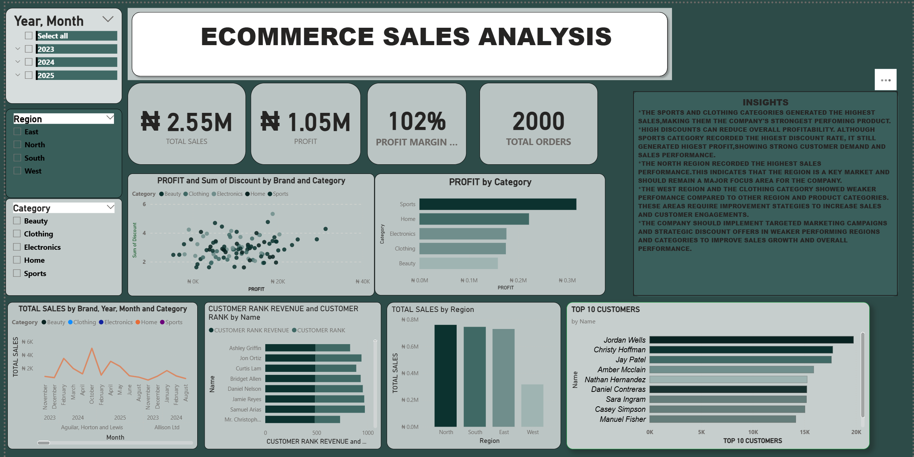
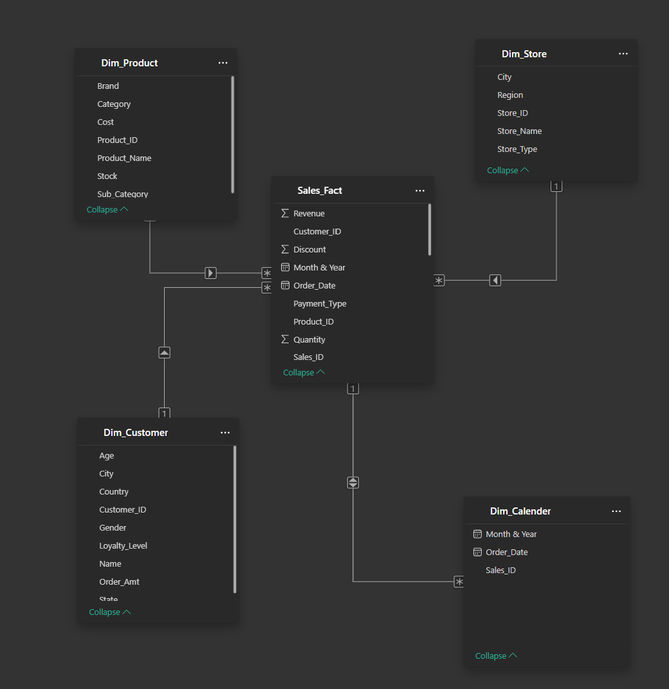
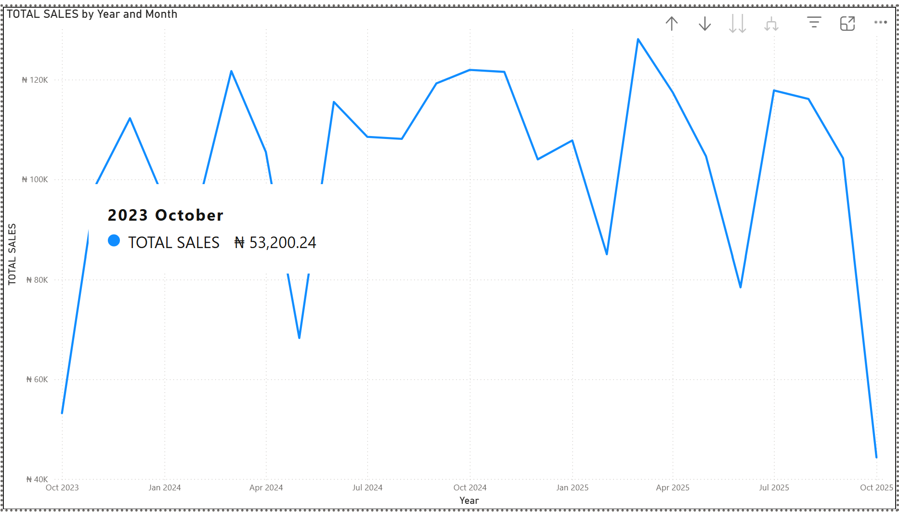
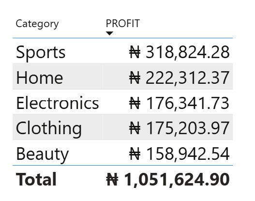
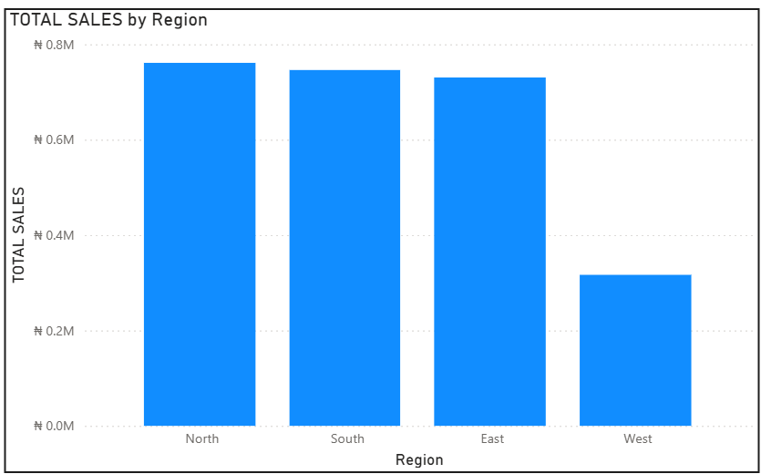
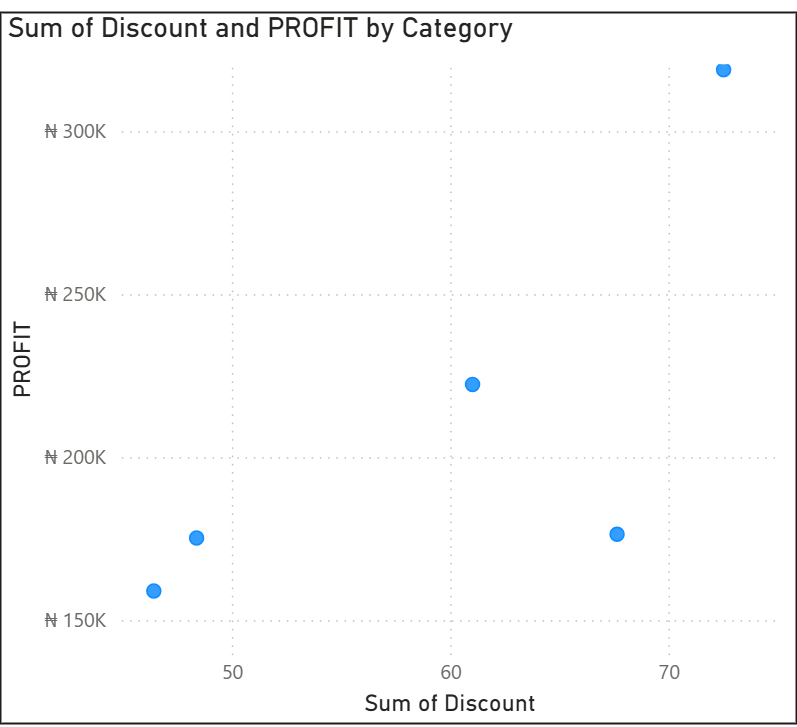
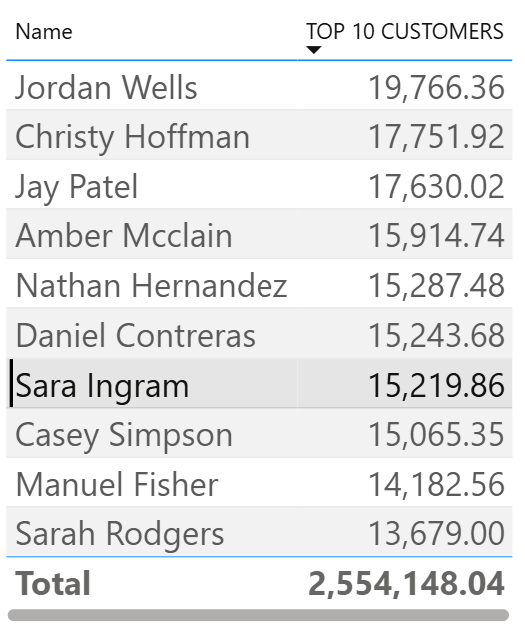

# E-Commerce Sales Performance & Profitability Analysis

A Power BI capstone project analyzing sales performance, customer behavior, and profitability for an e-commerce business — built from raw transaction data through a star-schema data model, DAX measures, and an interactive dashboard.


*Full dashboard — Total Sales, Profit, Profit Margin, Orders, and regional/category breakdowns.*

---

## 📌 Business Scenario

Management at an e-commerce company is concerned about:

- Fluctuating sales performance
- Declining profit margins
- Ineffective discount strategies
- Customer buying behavior

This project delivers a Power BI dashboard and a set of data-driven insights to help address these concerns.

## 🎯 Objectives

1. Clean and transform the raw data (Power Query)
2. Build a proper star-schema data model
3. Create DAX measures for revenue, profit, and growth
4. Develop an interactive dashboard
5. Provide business insights and recommendations

## 🗂️ Repository Contents

| File | Description |
|---|---|
| `MY_ECOMMERCE_DATA_SET_PROJECT.xlsx` | Raw source data (fact + dimension tables) |
| `MY_ECOMMERCE_PROJECT_PBI.pbix` | Power BI file — data model, DAX measures, dashboard |
| `README.md` | This file — project overview and setup |
| `report.md` | Full analysis report and business recommendations |
| `images/` | Dashboard and visual screenshots referenced in this repo |

## 🧱 Data Model (Star Schema)

**Fact table:** `Sales_Fact`
**Dimension tables:** `Dim_Customer`, `Dim_Product`, `Dim_Store`, `Dim_Calendar`

| Relationship | Cardinality |
|---|---|
| `Dim_Customer` → `Sales_Fact` (Customer_ID) | One-to-Many |
| `Dim_Product` → `Sales_Fact` (Product_ID) | One-to-Many |
| `Dim_Store` → `Sales_Fact` (Store_ID) | One-to-Many |
| `Dim_Calendar` → `Sales_Fact` (Order_Date) | One-to-Many |

All relationships filter in a single direction, from the dimension tables to the fact table.


*Star schema — one fact table, four dimension tables, single-direction filtering.*

## 🧮 Key DAX Measures

```DAX
Total Revenue      = SUM(Sales_Fact[Revenue])
Total Orders        = DISTINCTCOUNT(Sales_Fact[Sales_ID])
Average Order Value = DIVIDE([Total Revenue], [Total Orders])
Total Profit         = [Total Revenue] - [Total Cost]
Profit Margin %     = DIVIDE([Total Profit], [Total Revenue])
Sales LY             = CALCULATE([Total Revenue], SAMEPERIODLASTYEAR('Dim_Calendar'[Date]))
Sales Growth %       = DIVIDE([Total Revenue] - [Sales LY], [Sales LY])
```

## 📊 Dashboard Features

**Top KPIs:** Total Sales · Total Profit · Profit Margin % · Total Orders

**Visuals:**
- Sales Trend (Line Chart)
- Profit by Category (Bar Chart)
- Sales by Region (Clustered Chart)
- Discount vs. Profit (Scatter Plot)
- Top 10 Products (Bar Chart)
- Customer Ranking (Horizontal Clustered Bar Chart)

**Slicers:** Year · Region · Product Category · Customer Segment

## 🖼️ Supporting Visuals

| Sales Trend | Profit by Category |
|---|---|
|  |  |

| Sales by Region | Discount vs. Profit |
|---|---|
|  |  |



*These charts are generated directly from the source data (`MY_ECOMMERCE_DATA_SET_PROJECT.xlsx`) to mirror the dashboard's visuals. Swap in your own Power BI exports any time — just keep the same filenames.*

## 🛠️ Tools Used

- **Power BI Desktop** — data modeling, DAX, dashboard design
- **Power Query** — data cleaning and transformation
- **Excel** — source data

## 🚀 How to Use

1. Open `MY_ECOMMERCE_PROJECT_PBI.pbix` in Power BI Desktop.
2. Use the **Year, Region, Category** slicers to filter the dashboard.
3. Refer to `report.md` for the written analysis and recommendations behind each visual.

## 📄 Full Report

See [`report.md`](report.md) for the detailed findings, answers to the analysis questions, and business recommendations.
